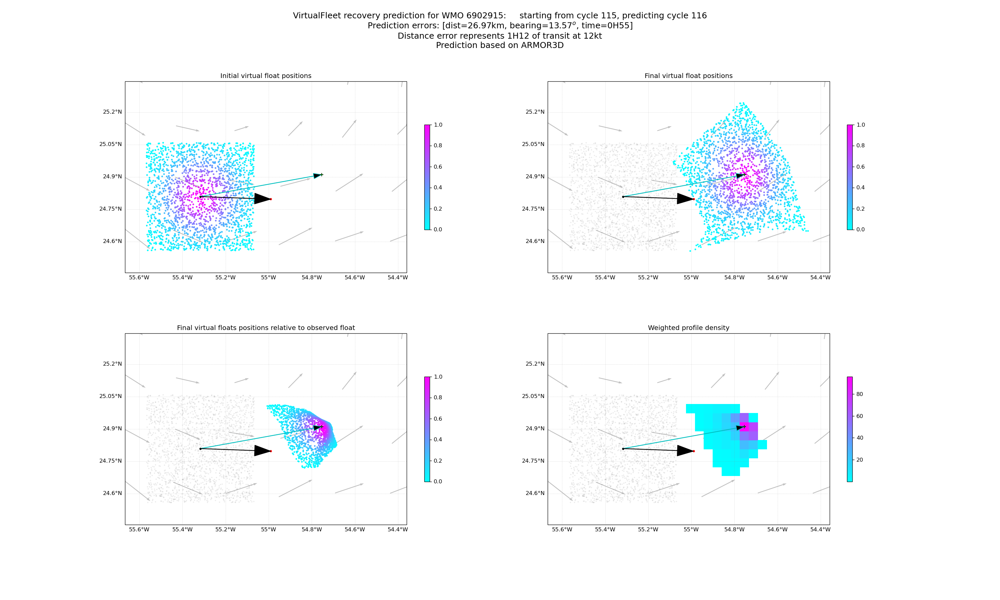

# VirtualFleet-recovery: Argo float recovery helper

The goal of this repository is to provide a library to make Argo floats trajectory predictions in order to facilitate recovery.  
The prediction _patch_ or _cone_ could be displayed on the map at: https://floatrecovery.euro-argo.eu  
More about Argo floats recovery in here: https://github.com/euroargodev/recovery/issues

## POC #1

## Working design of the procedure
1. Given a specific float cycle, we extract:
   - space/time position of the last cycle, 
   - configuration parameters, such as parking depth, profiling depth and cycling period using the EA API.

2. We download the hourly CMEMS velocity fields for the region around the last float cycle

3. We run a VirtualFleet simulation where:
    - in addition to the past configuration, we define a list of modified configuration parameters, such as a reduced cycling frequency or parking depth
    - for each of these configurations, we set-up virtual floats with a random perturbations the float position in space/time

4. For each of the virtual float configurations, we compute a probabilistic _recovery_ patch (basically the next profiles positions probability).

### Installation
- Get this repository:
```bash
git clone git@github.com:euroargodev/VirtualFleet_recovery.git
```
- Add the ``cli`` folder to your path, eg:
```bash
export PATH="/Users/gmaze/git/github/euroargodev/VirtualFleet_recovery/cli:$PATH"
```
- Make sure to get the appropriate Python 3.8 environment ([using this conda file](environment.yml)):
```bash
conda create -f environment.yml
```
- Install the experimental VirtualFleet "GulfStream" branch:
```bash
git clone --branch gulf-stream git@github.com:euroargodev/VirtualFleet.git
```

### CLI 

#### Usage
The ``recovery_prediction`` script allows making predictions, i.e. at this point, to produce a few figures to get an idea of where the float will make surface contact.

For a simple help, you can type:
```bash
recovery_prediction -h
```

To make prediction of where the 99th cycle of the 6902919 float will be, just type: 
```bash
recovery_prediction 6902919 99
```

A few options are available, like control on the output folder, the number of virtual floats or the velocity field to use:
```bash
recovery_prediction 6902919 99 --output data --nfloats=5000 --velocity=GLORYS
```

Use the ``--json`` option to only get prediction results as a json string.

Don't forget to:
- set the environment variables ``MOTU_USERNAME`` and ``MOTU_PASSWORD`` to be able to download the velocity field
- use the option ``vf`` to specify where the VirtualFleet software has been cloned.

#### Example
At this point, we're able to make test predictions for float cycles already observed.  

```bash
recovery_prediction 6902915 116
```
Below is an example of this prediction for the 99th cycle of the 6902919 float.  
The really observed 99th cycle is shown at the tip of the arrow (red point) starting from the previous 98th cycle.  
The VirtualFleet Recovery prediction is in the probabilistic red shading: the most probable position predicted is in the redder region.


### web API

In order to easily use prediction results with other (web)applications, we set-up a small web API based on [Flask](https://flask.palletsprojects.com/).

#### Server set-up

If you used the environment provided with this repo you already have Flask installed.
In order to set-up the (dev) server to access the VirtualFleet Recovery web API, you can type:
```bash
export FLASK_DEBUG=True
export FLASK_APP=app.py
#flask run  # localhost
#flask run --host=134.246.146.178  # Laptop @ Ifremer
flask run --host=134.246.146.54  # Pacnet @ Ifremer
```

#### Usage

You should know the ip address of the server where the Flask app is running.

**Making a prediction**

To make a prediction for the position of the ``CYC`` cycle from float ``WMO``, send a GET, or POST, request to:
```bash
    http://<IP>:5000/predict/<WMO>/<CYC>
```
This will return a json file with the prediction results. Predictions are saved in cache. 

Two options are possible:
   - ``velocity``: to select the velocity field to use, it can be ``ARMOR3D`` (default) or ``GLORYS``
   - ``nfloats``: to set the number of virtual floats to use in the probabilistic prediction. The default value is 2000.

Options can be used, or combined:
```bash
    http://<IP>:5000/predict/<WMO>/<CYC>?nfloats=1000
    http://<IP>:5000/predict/<WMO>/<CYC>?velocity=ARMOR3D
    http://<IP>:5000/predict/<WMO>/<CYC>?nfloats=1000&velocity=GLORYS
```

**Visualise prediction results**

We made a small webpage with figures and prediction data results. It is accessible at
```bash
    http://<IP>:5000/results/<WMO>/<CYC>
```
