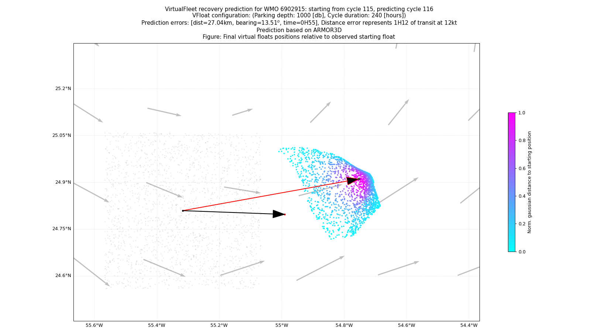

|<br>``Virtual Fleet - Recovery`` is a CLI to make predictions of Argo float positions|
|:---------------------------------------------------------------------------------------------------------------------------------------------------------------------------------------------------------------------------------------------------------------:|
|                                                                                 [](https://zenodo.org/badge/latestdoi/543618989)                                                                                  |

The goal of this repository is to provide a library to make Argo floats trajectory predictions easy, in order to facilitate recovery.  
The library produces a prediction _patch_ or _cone_ that could be displayed on a map like here: https://floatrecovery.euro-argo.eu  
More about Argo floats recovery in here: https://github.com/euroargodev/recovery/issues

New version compatible with [VirtualFleet 0.4.0](https://virtualfleet.readthedocs.io/en/latest/whats-new.html#v0-4-0-2-feb-2024) and using the [Copernicus Marine Toolbox](https://help.marine.copernicus.eu/en/collections/5821001-python-library-api) to retrieve GLORYS or ARMOR3D velocity fields.

# Documentation (preliminary)

## Overall prediction procedure
1. Given a specific float cycle to predict ``C``, we extract:
   - space/time position of the previous cycle ``C-1``, 
   - configuration parameters of the previous cycle ``C-1``, such as parking depth, profiling depth and cycling period using the EA API (but these can be overwritten if necessary).

2. We download the daily CMEMS velocity fields for a region around the previous cycle ``C-1`` coordinates

3. We run a VirtualFleet simulation: 
   - where we use a large number of virtual floats located with a random perturbations around the float cycle ``C-1`` position in space/time
   - for the cycle ``C-1`` duration

4. We compute the most probable position of the float cycle ``C`` and prediction metrics and figures.

The reason why we make random perturbations of the float cycle ``C-1`` position is not because the float position is uncertain (with GPS it is fairly accurate most of the time), but because it is a cheap way to account for errors in the velocity field. Indeed, we assume that the _phase_ of the velocity field used to advect floats is the primary source of uncertainties to predict the final position. We do not account for velocity shear/strain errors at this point. 

## Installation

Our goal is to distribute VFrecovery as a standalone pipy package. In the meantime, one need to work with this repo only.

- Download his repository:
```bash
git clone git@github.com:euroargodev/VirtualFleet_recovery.git
```
- Add the ``cli`` folder to your path, eg:
```bash
export PATH="/Users/gmaze/git/github/euroargodev/VirtualFleet_recovery/cli:$PATH"
```
- Make sure to get the appropriate Python 3.9 environment ([using this conda file](environment.yml)):
```bash
mamba env create -f environment.yml
```
- Install the last VirtualFleet version:
```bash
git clone git@github.com:euroargodev/VirtualFleet.git
```

## Command line instructions

### Usage
The ``recovery_prediction.py`` script allows making predictions, i.e. at this point to produce:
- a json data files with predictions information for machine/machine applications,
- and a few figures to indicate where the float will make surface contact and how the probability patch was created. 

For a simple help, you can type:
```
recovery_prediction.py -h
```

To make prediction of where the 99th cycle of the 6902919 float will be, just type: 
```
recovery_prediction.py 6902919 99
```

You can also predict more than one cycle:
```
recovery_prediction.py 6902919 99 100 101
```

A few options are available:
```
usage: recovery_prediction.py [-h] [--nfloats NFLOATS] [--output OUTPUT] [--velocity VELOCITY] [--domain_size DOMAIN_SIZE] [--save_figure SAVE_FIGURE] [--save_sim SAVE_SIM]
                              [--vf VF] [--json] [--cfg_parking_depth CFG_PARKING_DEPTH] [--cfg_cycle_duration CFG_CYCLE_DURATION] [--cfg_profile_depth CFG_PROFILE_DEPTH]
                              wmo cyc [cyc ...]

VirtualFleet recovery predictor

positional arguments:
  wmo                   Float WMO number
  cyc                   Cycle number to predict

optional arguments:
  -h, --help            show this help message and exit
  --nfloats NFLOATS     Number of virtual floats used to make the prediction, default: 2000
  --output OUTPUT       Output folder, default: webAPI internal folder
  --velocity VELOCITY   Velocity field to use. Possible values are: 'ARMOR3D' (default), 'GLORYS'
  --domain_size DOMAIN_SIZE
                        Size (deg) of the velocity domain to load, default: 12
  --save_figure SAVE_FIGURE
                        Should we save figure on file or not ? Default: True
  --save_sim SAVE_SIM   Should we save the simulation on file or not ? Default: False
  --vf VF               Parent folder to the VirtualFleet repository clone
  --json                Use to only return a json file and stay quiet
  --cfg_parking_depth CFG_PARKING_DEPTH
                        Virtual floats parking depth in [db], default: use previous cycle value
  --cfg_cycle_duration CFG_CYCLE_DURATION
                        Virtual floats cycle duration in [hours], default: use previous cycle value
  --cfg_profile_depth CFG_PROFILE_DEPTH
                        Virtual floats profiles depth in [db], default: use previous cycle value

This script can be used to make prediction of a specific float cycle position.
    This script can be used on past or unknown float cycles.
    Note that in order to download online velocity fields from the Copernicus Marine Data Store, you need to have the
    appropriate credentials file setup.

(c) Argo-France/Ifremer/LOPS, 2022-2024
```

So, don't forget to:
- set up your environment to be able to download velocity fields from the Copernicus Marine Toolbox
- use the option ``vf`` to specify where the VirtualFleet software has been cloned (this is temporary and will change once VirtualFleet will be available on Pypi).

### Example

```
recovery_prediction.py 6902915 116
```
Below is an example of this prediction for the 116th cycle of the 6902919 float.  
The really observed 116th cycle is shown at the tip of the arrow (red point) starting from the previous 115th cycle.  
The VirtualFleet Recovery prediction is in the probabilistic red shading: the most probable position predicted is in the redder region.

